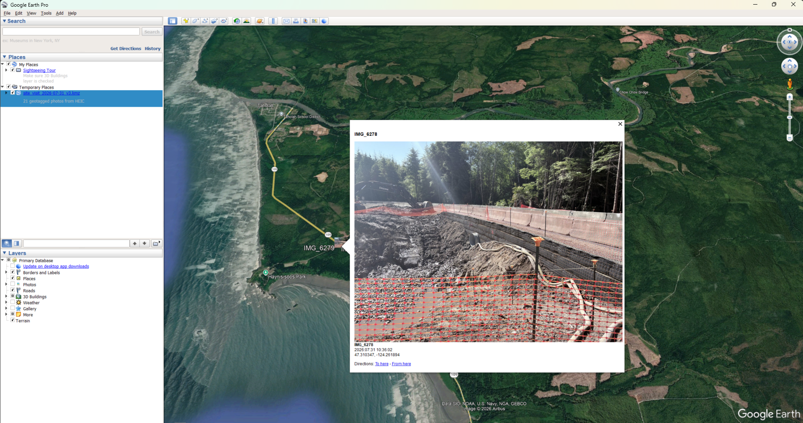

# heic-to-kmz

Converts geotagged iPhone HEIC photos into a self-contained KMZ file for viewing in Google Earth Pro.



---

# English

## Overview

`heic_to_kmz.py` processes a folder of iPhone HEIC photographs and produces a single KMZ file in which each photograph appears as a placemark at its recorded GPS location. The KMZ is self-contained: images are embedded in the archive, so the file can be shared or archived without accompanying assets.

The conversion performs three tasks:

1. **Format conversion** — HEIC images are decoded and re-encoded as JPEG, which Google Earth Pro can render. HEIC files themselves are not displayable in Google Earth Pro.
2. **EXIF normalization** — Apple's HEIC EXIF GPS data does not fully conform to the EXIF specification (the GPS IFD omits `GPSVersionID` and stores `GPSProcessingMethod` with an incorrect type). Some downstream parsers, including Google's photo ingestion, reject the entire GPS IFD when these anomalies are present. The script extracts the coordinate values directly and rebuilds a conformant EXIF block rather than copying the original bytes.
3. **Image sizing** — two versions of each photo are generated: a display-size JPEG for the placemark balloon, and a small thumbnail used as the map icon. This keeps the map responsive while still providing a detailed view on selection.

## Requirements

- Python 3.8+
- `pillow`, `pillow-heif`, `exifread`, `piexif`
- Google Earth Pro (desktop) for viewing. The web version of Google Earth does not support images embedded in placemark descriptions.

## Usage

```bash
pip install -r requirements.txt
python heic_to_kmz.py <photos_folder> <output.kmz>
```

Options:

```bash
python heic_to_kmz.py <src_dir> <out.kmz> [--max-edge 2048] [--quality 85] [--thumb 128]
```

| Option | Default | Description |
|--------|---------|-------------|
| `--max-edge` | 2048 | Maximum long-edge dimension (pixels) for balloon images |
| `--quality` | 85 | JPEG quality for generated images |
| `--thumb` | 128 | Thumbnail dimension (pixels) used for map icons |

Photos without GPS data are skipped and reported in the console output.

## Output

The output is a KMZ archive (a ZIP container):

```
output.kmz
├── doc.kml      # placemarks: coordinates + image references
├── files/       # display-size JPEGs
└── thumbs/      # thumbnail images used as map icons
```

The KMZ can be opened by double-clicking the file or via File → Open in Google Earth Pro.

## Agent skill installation

This repository includes `SKILL.md`, which conforms to the Agent Skills open standard (agentskills.io). It can be installed as a skill in Hermes, Codex CLI, Claude Code, or other compatible agents:

```bash
hermes skills install "https://github.com/wyuebei-cloud/heic-to-kmz/raw/refs/heads/main/SKILL.md"
```

Alternatively, copy the `SKILL.md` and `scripts/` directories into the agent's skills directory.

## License

MIT — see [LICENSE](LICENSE).

---

# 中文

## 概述

`heic_to_kmz.py` 读取一个包含 iPhone HEIC 照片的文件夹，生成单个 KMZ 文件，每张照片按其记录的 GPS 坐标在地图上显示为标记点。KMZ 为自包含格式，图片嵌入压缩包内，可单独分享或归档，无需附带其他文件。

转换过程包含三个步骤：

1. **格式转换** — HEIC 图像被解码并重新编码为 JPEG。Google Earth Pro 无法直接显示 HEIC 文件。
2. **EXIF 规范化** — 苹果 HEIC 中的 GPS EXIF 数据不完全符合 EXIF 规范（GPS IFD 缺少 `GPSVersionID`，`GPSProcessingMethod` 的类型不正确）。部分下游解析器（包括 Google 的照片摄入流程）在检测到这些异常时会拒绝读取整个 GPS IFD。脚本直接提取坐标值并重建符合规范的 EXIF 块，而非拷贝原始字节。
3. **图片尺寸分级** — 每张照片生成两个版本：用于标记弹窗的显示尺寸 JPEG，以及用作地图图标的缩略图。这样既保证地图流畅，又能在选中时查看细节。

## 环境要求

- Python 3.8+
- 依赖：`pillow`、`pillow-heif`、`exifread`、`piexif`
- 查看需要 Google Earth Pro（桌面版）。Google Earth 网页版不支持标记弹窗内嵌图片。

## 使用方法

```bash
pip install -r requirements.txt
python heic_to_kmz.py <照片文件夹> <输出.kmz>
```

可选参数：

```bash
python heic_to_kmz.py <src_dir> <out.kmz> [--max-edge 2048] [--quality 85] [--thumb 128]
```

| 参数 | 默认值 | 说明 |
|------|--------|------|
| `--max-edge` | 2048 | 弹窗图片最长边（像素） |
| `--quality` | 85 | 生成图片的 JPEG 质量 |
| `--thumb` | 128 | 地图图标缩略图尺寸（像素） |

无 GPS 数据的照片会被跳过，并在控制台输出中列出。

## 输出

输出为 KMZ 压缩包（本质是 ZIP 容器）：

```
output.kmz
├── doc.kml      # 标记点：坐标 + 图片引用
├── files/       # 显示尺寸 JPEG
└── thumbs/      # 用作地图图标的缩略图
```

双击文件，或在 Google Earth Pro 中通过 File → Open 打开。

## 作为 Agent skill 安装

本仓库包含符合 Agent Skills 开放标准（agentskills.io）的 `SKILL.md`，可用于 Hermes、Codex CLI、Claude Code 等兼容 agent：

```bash
hermes skills install "https://github.com/wyuebei-cloud/heic-to-kmz/raw/refs/heads/main/SKILL.md"
```

或将 `SKILL.md` 与 `scripts/` 目录复制到 agent 的 skills 目录中。

## 许可证

MIT —— 见 [LICENSE](LICENSE)。
